```mermaid
flowchart TD
    classDef meta fill:#1a1a2e,stroke:#7c3aed,color:#e2e8f0
    classDef phase fill:#0f172a,stroke:#3b82f6,color:#e2e8f0
    classDef book fill:#1e293b,stroke:#64748b,color:#94a3b8
    classDef arrow color:#64748b

    %% ── META LAYER ─────────────────────────────────────────────────────────
    subgraph LOONSHOTS["LOONSHOTS  ·  Organizational Structure for Innovation"]
        direction LR
        nursery["🔬 Nursery\n─────────────\nArtists & Explorers\nIdeas breathe here\nNo appetite constraints\nFalse-fail protected"]
        franchise["🏭 Franchise\n─────────────\nSoldiers & Executors\nDelivers current product\nTime-boxed, scoped work"]
        nursery <-->|"Two-way feedback\nfield-tests → nursery\nlearnings → execution"| franchise
    end

    loonshots_note["Loonshots is not a step — it is the organizational\nphilosophy that keeps both tracks alive.\nAt ~150 people orgs stop exploring and start politicking.\nSeparation of nursery and franchise prevents this."]

    LOONSHOTS --- loonshots_note

    %% ── PIPELINE ────────────────────────────────────────────────────────────
    subgraph STEP1["1 · INNOVATION  —  Competing Against Luck"]
        direction TB
        job_q["What job is the customer hiring a product to do?"]
        job_dim["Functional job · Social job · Emotional job"]
        job_story["Job Story:\nWhen [circumstance]\nI want [motivation]\nso I can [outcome]"]
        forces["Four forces:\nPush (pain now) · Pull (new promise)\nAnxiety (will it work?) · Habit (safe familiar)"]
        job_q --> job_dim --> job_story
        job_story --- forces
    end

    subgraph STEP2["2 · VALIDATION  —  Lean Startup"]
        direction TB
        gates["Four gates before building:\n① Is the problem real?\n② Would they pay?\n③ Would they buy from us?\n④ Can we build it?"]
        bml["Build → Measure → Learn\n1–3 day loops, measure against pre-set targets"]
        mvp_ladder["MVP ladder:\nSmoke test → Concierge\n→ Wizard of Oz → Single-feature"]
        pivot["Outcome: Persevere · Pivot · Kill\n(Kill fast, learn cheap)"]
        gates --> bml --> mvp_ladder --> pivot
    end

    subgraph STEP3["3 · SHAPING  —  Shape Up"]
        direction TB
        appetite["Set appetite first\n(Fixed time · Variable scope)"]
        shape_work["Shape the work:\nRough (room to explore)\nSolved (clear direction)\nBounded (explicit no-gos)"]
        pitch["Pitch:\nProblem · Solution · Appetite · Rabbit holes · No-gos"]
        cycle["Build cycle:\nOne vertical slice first\nUphill = unknowns · Downhill = execution"]
        appetite --> shape_work --> pitch --> cycle
    end

    subgraph STEP4["4 · DEVELOPMENT  —  Refactoring UI + Brand Book"]
        direction TB
        system["Design system first:\nType scale · Spacing scale\nColor palette · Shadows"]
        hierarchy["Hierarchy without fighting:\nUse color + weight (not size)\nDe-emphasize weak, don't inflate strong"]
        action_h["Action hierarchy:\nPrimary (solid) · Secondary (outline) · Tertiary (link)"]
        loop["Design → Build → Iterate → Next\n(Not all screens upfront)"]
        system --> hierarchy --> action_h --> loop
    end

    %% ── CONNECTIONS ─────────────────────────────────────────────────────────
    nursery -.->|"Protects the bet\nbefore it's validated"| STEP1
    STEP1 -->|"Job statement becomes\nproblem statement"| STEP2
    STEP2 -->|"Value hypothesis proven\nReady to scope"| STEP3
    STEP3 -->|"Bounded work\nReady to build"| STEP4
    STEP4 -.->|"Shipped product\nfield-tests franchise\nlearnings return to nursery"| franchise
```

# JT Digital Product Development Pipeline

How we move from raw idea to shipped, high-quality product — and what each framework teaches us along the way.

---

---

## What Each Framework Teaches

| # | Framework | Book | Core Question | Output |
|---|-----------|------|--------------|--------|
| — | **Loonshots** | Safi Bahcall | How do we keep radical ideas alive inside a growing organization? | Separated nursery + franchise structure with two-way feedback |
| 1 | **Innovation** | *Competing Against Luck* · Clayton Christensen | What job is the customer actually hiring a product to do? | Job story: circumstance → motivation → outcome |
| 2 | **Validation** | *The Lean Startup* · Eric Ries | Is the problem real, and will people pay for a solution? | Evidence-backed go/no-go before writing production code |
| 3 | **Shaping** | *Shape Up* · Ryan Singer | How do we scope a validated idea so it ships within a fixed time? | Pitch: rough, solved, bounded — with appetite set first |
| 4 | **Development** | *Refactoring UI* · Adam Wathan & Steve Schoger | How do we implement it with a high-quality, systematic design? | Constrained design system + hierarchy-first visual decisions |

---

## Key Integration Rules

**Loonshots ↔ Lean Startup** — Loonshots decides *which* experiments deserve protection. Lean Startup runs those experiments cheaply and fast.

**JTBD → Lean Startup** — A well-formed job story creates better hypotheses. Instead of "users will click more," you test "users hired this to feel ready before their first client call."

**Lean Startup → Shape Up** — The gate-4 answer ("can we build it?") and a proven value hypothesis trigger Shape Up. Before that point, appetite doesn't apply — ideas need room to breathe.

**JTBD → Shape Up** — A validated job statement IS a Shape Up problem statement. "Sharing multiple files takes too many steps" describes circumstance + struggle.

**Shape Up → Refactoring UI** — Shape Up defines scope. Refactoring UI provides the design system and methodology to execute that scope beautifully. Brand Book overrides Refactoring UI on concrete choices (fonts, colors, components, spacing, shadows).

---

## Where Loonshots Sits

Loonshots is **not a phase** — it is the organizational philosophy that makes the whole pipeline work at scale.

- **Before Lean Startup**: use Loonshots thinking to decide *which* bets are worth protecting and running experiments on.
- **Alongside Shape Up**: the loonshot nursery is where appetite doesn't apply — ideas need room to breathe before they're ready to be shaped.
- The nursery-to-franchise handoff is the moment a validated idea enters Step 3 (Shaping).
